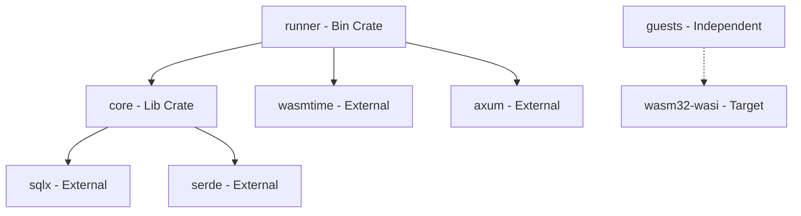

# 01 - Architecture and Data Flow

## 1.1 Crate Dependency Graph

The workspace is structured to ensure that business logic (Core) is decoupled from the delivery mechanism (Runner).

| Crate               | Responsibility                                      | Primary Dependencies                 |
| :------------------ | :-------------------------------------------------- | :----------------------------------- |
| `serverless-runner` | HTTP Entry, Wasm Orchestration, WASI Piping         | `core`, `axum`, `wasmtime`, `tokio`  |
| `serverless-core`   | DB Schema, SQLx Queries, Shared Models, Error Enums | `sqlx`, `thiserror`, `serde`, `uuid` |
| `guests/*`          | Isolated Logic, Stdin processing, Stdout response   | `std` (restricted), `serde`          |

## 1.2 The Store-Engine Split

A critical architectural requirement for Wasmtime performance and safety is the separation of the `Engine` and the `Store`.

### The Global `wasmtime::Engine`

- **Lifecycle:** Created exactly once at application startup.
- **Role:** Handles JIT compilation (Cranelift), optimization, and shared resource management.
- **Thread Safety:** Implements `Send` and `Sync`. It is stored inside an `Arc` within the Axum `AppState`.
- **Cost:** Extremely high initialization cost; must be reused.

### The Per-Request `wasmtime::Store<T>`

- **Lifecycle:** Created at the start of every HTTP request.
- **Role:** Holds the actual instance of a Wasm module and its linear memory.
- **Isolation:** Provides the hard boundary. If a guest crashes or leaks memory, it only affects its specific `Store`.
- **Data Context:** Holds the `WasiCtx`, which tracks file descriptors (pipes) for that specific request.

## 1.3 Memory Safety and Sandboxing

The Runner acts as a "Trust-Free" host.

1. **Address Space Isolation:** Wasm operates in a "Linear Memory" model. The guest cannot access the host's pointers or memory address space.
2. **Capability-Based Security (WASI):** The guest has zero access to the host file system, network, or clock unless explicitly granted via `WasiCtxBuilder`.
3. **The Proxy Pattern:** All communication happens through `stdin` and `stdout` memory pipes. The Runner reads the guest's `stdout` only after the guest has yielded or exited.

## 1.4 Sequence Diagram: Request to Response

1. **Runner:** Receives POST.
2. **Runner:** Calls `core::db::log_execution_start`.
3. **Runner:** Loads `.wasm` from disk.
4. **Runner:** Initializes `Store` with a new `WasiCtx`.
5. **Runner:** Pipes Request Body -> `WasiCtx.stdin`.
6. **Wasm:** Executes `_start`.
7. **Wasm:** Writes to `stdout`.
8. **Runner:** Captures `stdout` buffer.
9. **Runner:** Calls `core::db::complete_execution`.
10. **Runner:** Returns `stdout` as HTTP Body.
