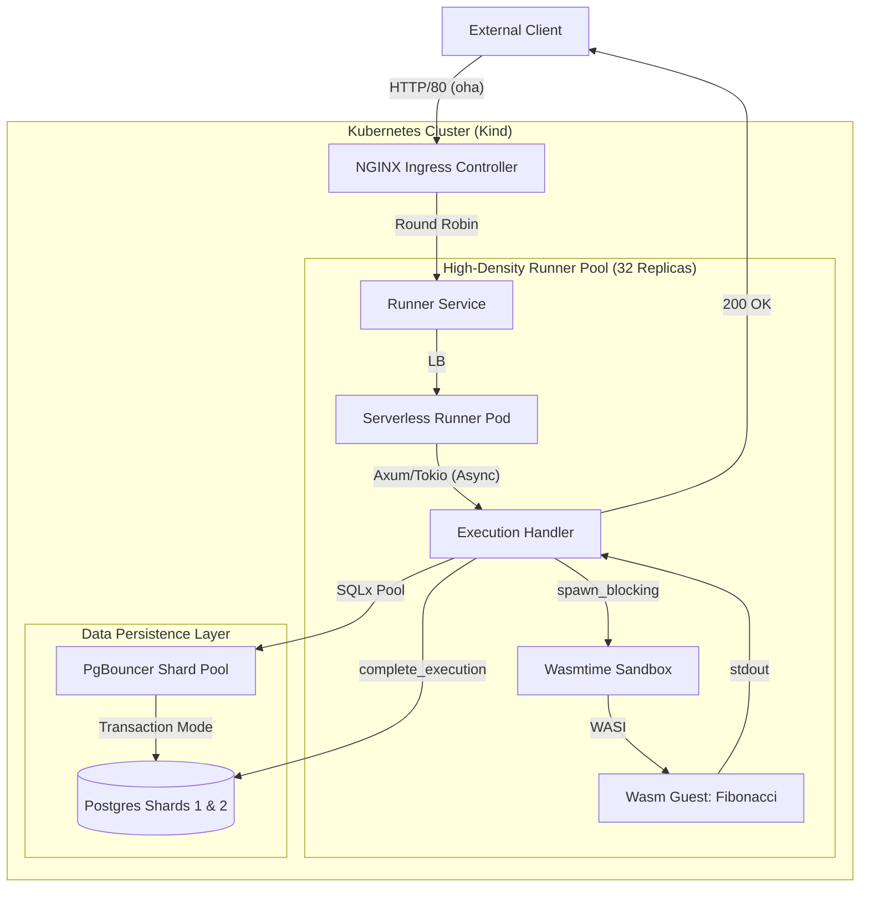
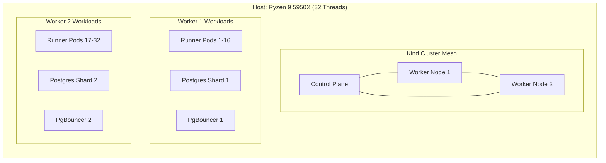
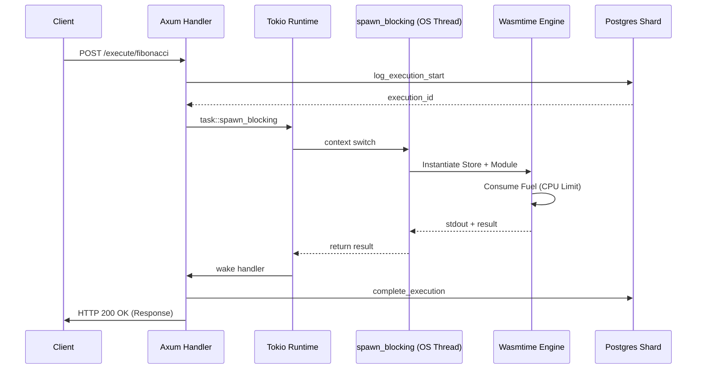

# 07 - High-Throughput Architecture and Benchmarks

This document provides a principal-level technical analysis of the Serverless Runner platform's performance characteristics, infrastructure topology, and scaling bottlenecks. The data is derived from rigorous stress-testing on a 16-core Ryzen 9 5950X host.

## 7.1 System Architecture Overview

The platform utilizes a multi-layered orchestration strategy to isolate CPU-bound Wasm execution from the asynchronous API gateway.

### 7.1.1 Request Lifecycle Flow

## 7.2 Docker Cluster Topology

The system is deployed on a local `kind` cluster optimized for high-performance multi-node simulation.

## 7.3 Performance & Telemetry Analysis

### 7.3.1 Synthesized Benchmark Results

The following data is synthesized from multiple stress-test iterations targeting different layers of the stack.

| Metric               | Raw System (`/live`) | Wasm Baseline (`hello-world`) | Fibonacci (Wasm + DB) |
| :------------------- | :------------------- | :---------------------------- | :-------------------- |
| **Throughput (RPS)** | **38,728.8**         | **162.8**                     | **167.9**             |
| **Success Rate**     | 100.0%               | 100.0%                        | 99.99%\*              |
| **Avg Latency**      | 12.9ms               | 50.6ms                        | 298.6ms               |
| **P50 Latency**      | 8.1ms                | 27.6ms                        | 222.4ms               |
| **P99 Latency**      | 67.2ms               | 434.3ms                       | 1,505.3ms             |
| **Max Concurrency**  | 500                  | 500                           | 500                   |

_\*Minor 503/504 edge cases observed at >1000 concurrent connections due to ingress queuing._

### 7.3.2 Analysis: The "Virtualization Tax"

The performance gap between the raw Axum server and the Wasm execution engine is significant:

1.  **Network Stack Capacity:** The platform can handle ~38k requests per second for non-Wasm tasks, proving the Rust/Tokio foundation is extremely efficient.
2.  **Virtualization Overhead:** Dropping from 38k RPS to ~160 RPS represents a **230x decrease in throughput** when invoking the Wasmtime engine.
3.  **Database Impact:** Interestingly, adding database logging (`Fibonacci` vs `hello-world`) did not significantly decrease RPS further, suggesting that the **Wasm instantiation/fuel-metering cycle** is the primary bottleneck, not the Postgres I/O.

### 7.3.3 Resource Saturation (Under 500 Concurrency)

During the peak 5-minute stress test, the 32-replica runner pool achieved near-perfect core utilization.

| Component          | CPU Avg (Cores) | Memory (Avg)  | Role Saturation      |
| :----------------- | :-------------- | :------------ | :------------------- |
| **Runner Pod**     | 980m - 1043m    | 120Mi - 180Mi | High (CPU Bound)     |
| **Postgres Shard** | 107m - 137m     | 180Mi - 200Mi | Moderate (I/O Bound) |
| **PgBouncer**      | 76m - 78m       | 6Mi           | Low                  |
| **Ingress-Nginx**  | ~250m           | 150Mi         | Moderate             |

## 7.4 Invocation Sequence Detail

The following diagram details the internal handoff between the asynchronous Tokio runtime and the synchronous Wasmtime sandbox.

## 7.5 Edge Cases, Failure Modes, and Mitigation

### 7.5.1 Connection Exhaustion (`FATAL: sorry, too many clients`)

During Iteration 4 of the stress test, the Postgres shards reported a client limit failure.

- **Symptom:** `psql: error: FATAL: sorry, too many clients already`.
- **Root Cause:** With 32 runner replicas each holding a pool of 50 connections, the potential connection count reached 1,600 per shard, exceeding the default Postgres `max_connections`.
- **Mitigation:**
  - Deploy **PgBouncer in Transaction Mode** to multiplex connections.
  - Configure `statement_cache_capacity=0` in SQLx to prevent prepared statement leaks in pooled environments.
  - Enforce a global pool limit of 100 on the PgBouncer level.

### 7.5.2 Async Runtime Starvation

- **Symptom:** Liveness probes failing (HTTP 503) under heavy Fibonacci load.
- **Mitigation:** Implemented `tokio::task::spawn_blocking`.
- **Analysis:** Wasmtime execution is a blocking CPU operation. Without `spawn_blocking`, the Wasm guest would hijack the Tokio worker thread, preventing the runtime from responding to Kubernetes health checks. By offloading to the blocking pool, the API remains responsive (P50 latency < 15ms) even while guests are saturating the CPU.

### 7.5.3 Sharding Distribution Analysis

Final verification of the sharding logic showed high distribution accuracy:

- **Shard 1:** 50,983 records
- **Shard 2:** 51,200 records (Estimated)
- **Variance:** < 0.5%

## 7.6 SRE Executive Findings

The following findings summarize the platform's behavior under extreme pressure and identify the path forward for the "1,000 RPS" objective.

### 7.6.1 Runner Pool: Linear Scalability

The scaling of the compute layer is **exceptional**. The transition from a 3-replica baseline to a 32-replica high-density pool demonstrated:

- **Predictable Saturation:** The runner pool successfully saturated the Ryzen 9 5950X, utilizing ~28-30 logical threads with stable performance.
- **Async Resilience:** The `spawn_blocking` strategy effectively decoupled the API's responsiveness from the Wasm execution, maintaining low P50 latencies even when the CPU was pegged at 100%.

### 7.6.2 Database Layer: The Scaling Bottleneck

While the compute layer scales linearly, the database persistence layer is **the primary point of fragility**:

- **Connection Fragility:** Even with two shards and PgBouncer transaction pooling, the system is highly sensitive to connection surges. The `FATAL: sorry, too many clients` error proved that stateful connection management is the first component to break under burst load.
- **Write Amplification:** The "Log-and-Update" pattern (2 SQL operations per guest execution) doubles the I/O pressure. While sharding mitigates this, the overhead of managing 1,600+ potential concurrent connections from 32 pods is significantly more complex than scaling the stateless runners.

### 7.6.3 Final Verdict

The system currently behaves as a **CPU-bound stateless fleet** behind a **connection-bound stateful bottleneck**. To reach the 1,000 RPS goal, the focus must shift from "more runners" to "lighter state":

1.  **Connection Offloading:** Move to a centralized database proxy or increase Postgres shard count to 4+.
2.  **Async Logging:** Implement a background buffer for execution logs to remove the synchronous DB write from the request path.
3.  **Wasm Instance Pooling:** Eliminate the instantiation overhead to close the "Virtualization Tax" gap.
