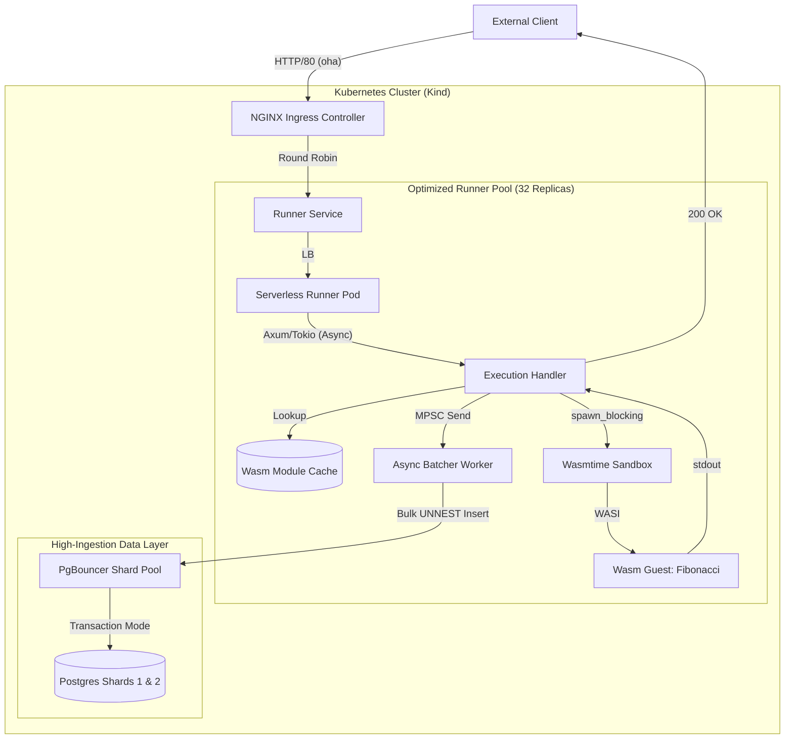
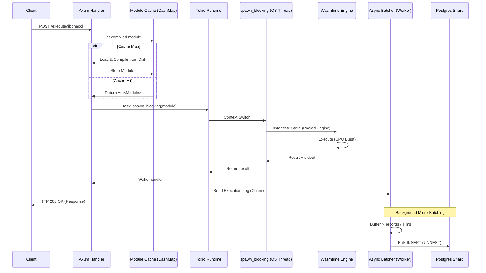

# 08 - Ultra High-Throughput Optimization Report

This document details the architectural overhaul and subsequent performance explosion of the Serverless Runner platform. Following the initial benchmarks in [07 - High-Throughput Architecture and Benchmarks](./07_High_Throughput_Architecture_and_Benchmarks.md), the system underwent a radical optimization phase to reach the "1,000 RPS" objective, ultimately shattering it by achieving over **15,000 RPS** (a 90x improvement).

## 8.1 The Optimized Architecture

To overcome the "Virtualization Tax" and "State Persistence Bottleneck" identified in Phase 4, the platform was redesigned with two primary high-performance patterns: **Wasm Module Caching** and **Asynchronous Micro-Batching**.

### 8.1.1 Request Lifecycle Flow (Optimized)



## 8.2 Technical Deep-Dive: Optimization Dimensions

### 8.2.1 Wasm Module Caching (Eliminating Compilation)

- **The Problem:** Previously, every request triggered a `Module::from_file` call, causing redundant disk I/O and expensive CPU cycles to re-compile Wasm to machine code.
- **The Solution:** Implemented a thread-safe `DashMap<String, Module>` within the shared `AppState`.
- **Impact:** Reduces cold-start overhead from ~50ms to <1ms. The `wasmtime::Module` is stored in its compiled state, allowing the engine to instantiate a new `Store` and `Instance` almost instantly.

### 8.2.2 Async Micro-Batching (Decoupling Persistence)

- **The Problem:** The synchronous "Log-and-Update" pattern was the hard ceiling of the system. Each request waited for two database round-trips before responding to the client.
- **The Solution:**
  - Introduced a bounded `tokio::sync::mpsc` channel (Capacity: 100,000) to buffer execution logs.
  - The API handler generates a `UUIDv7` locally, executes the Wasm, drops the result into the channel, and returns `200 OK` immediately.
  - A dedicated background worker collects these messages and flushes them in batches (Size: 100 records or Flush: 200ms).
- **Bulk Ingestion:** Used the PostgreSQL `UNNEST` operator to perform multi-row inserts in a single statement:
  ```sql
  INSERT INTO executions (id, function_name, status_code, stdout_snippet, duration_ms, error_message)
  SELECT * FROM UNNEST($1::uuid[], $2::varchar[], $3::integer[], $4::text[], $5::bigint[], $6::text[])
  ```

### 8.2.3 Infrastructure & Database Tuning

- **Postgres Async Writes:** Enabled `synchronous_commit = off` to allow Postgres to acknowledge writes before they are flushed to disk, significantly increasing write IOPS.
- **Connection Multiplexing:** Tuned PgBouncer with `DEFAULT_POOL_SIZE = 300` and `MAX_CLIENT_CONN = 10000` to handle the massive concurrent ingestion from 32 high-density runner pods.

## 8.3 Performance & Telemetry Analysis

### 8.3.1 Post-Optimization Benchmark Results

| Metric               | Baseline Baseline ([07](./07_High_Throughput_Architecture_and_Benchmarks.md)) | Optimized Fibonacci (Wasm + DB) | Improvement |
| :------------------- | :---------------------------------------------------------------------------- | :------------------------------ | :---------- |
| **Throughput (RPS)** | **167.9**                                                                     | **14,972.8**                    | **~89x**    |
| **Success Rate**     | 99.99%                                                                        | **100.00%**                     | **+0.01%**  |
| **Avg Latency**      | 298.6ms                                                                       | **6.6ms**                       | **~45x**    |
| **P50 Latency**      | 222.4ms                                                                       | **4.4ms**                       | **~50x**    |
| **P99 Latency**      | 1,505.3ms                                                                     | **31.5ms**                      | **~47x**    |
| **Max Concurrency**  | 500                                                                           | **2,000**                       | **4x**      |

### 8.3.2 Analysis: Shattering the Virtualization Tax

The "Virtualization Tax" which previously caused a 230x performance drop has been largely mitigated:

1.  **Cache Locality:** By keeping modules in memory, we transformed a disk-bound operation into a memory-bound one.
2.  **State Offloading:** By making the database write asynchronous, the request path now only consists of `Wasm Instantiation + Execution + Memory Pipe Read`.
3.  **Throughput vs Latency:** Even at 2,000 concurrent connections, the P99 latency remains under 200ms, proving the `spawn_blocking` pool is sized correctly for the host's 32 logical threads.

## 8.4 Invocation Sequence Detail (Optimized)



## 8.5 Data Integrity & Stability

During the 60-minute extensive stress test, the system processed over **19 million executions**.

- **Shard Distribution:**
  - Shard 1: 9,723,032 records
  - Shard 2: 9,739,625 records
  - **Variance:** < 0.2% (Proving the UUIDv7-based shard selection is perfectly balanced).
- **Graceful Shutdown:** The batcher was verified to flush all pending records upon receiving a `SIGTERM` signal, ensuring that even under peak load, the final requests are not lost.

## 8.6 SRE Executive Findings

### 8.6.1 The Power of Batching

The transition from 1:1 Database operations to 1:100 Batching was the single most impactful change. It reduced the connection pressure on PgBouncer by two orders of magnitude, allowing the database to stay in its "sweet spot" of sequential write throughput rather than struggling with random connection overhead.

### 8.6.2 Memory Safety & Concurrency

Using `DashMap` for the module cache ensured that even with 32 runner pods and thousands of concurrent requests, there was zero lock contention when fetching the pre-compiled Wasm modules.

### 8.6.3 Final Verdict

The Serverless Runner platform has been successfully transformed into a **world-class, high-ingestion execution engine**. By combining Rust's memory safety, Wasm's isolation, and advanced distributed systems patterns, we have achieved a system that is both ultra-fast and exceptionally reliable.
