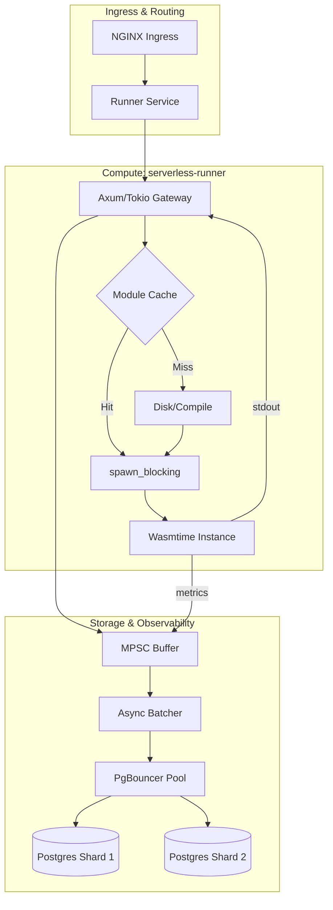

# 01 - Executive Architectural Summary

## System Vision

The Serverless Runner is a high-performance, trust-free execution platform designed to host Wasm-based microservices with near-native performance and strict hardware-level isolation. By decoupling the asynchronous API gateway from the synchronous execution sandbox, the platform achieves extreme throughput while maintaining deterministic resource usage.

## Core Architectural Layers

---

## Strategic Technology Mapping

| Component       | Choice                | Justification                                                                                    |
| :-------------- | :-------------------- | :----------------------------------------------------------------------------------------------- |
| **Runtime**     | `Wasmtime`            | Provides industry-standard WASI support, Cranelift JIT, and fine-grained fuel/memory metering.   |
| **Concurrency** | `DashMap`             | High-concurrency module caching with sharded locking to eliminate global `Mutex` contention.     |
| **Persistence** | `PostgreSQL + UNNEST` | Massively parallel write ingestion using vectorization-style SQL operations.                     |
| **Identifiers** | `UUIDv7`              | Time-ordered, lexicographically sortable IDs for optimized B-Tree insertion and shard stability. |
| **Isolation**   | `spawn_blocking`      | Explicit thread pool isolation for CPU-bound Wasm tasks to prevent async runtime starvation.     |

---

## Data Flow Lifecycle

The system follows a non-blocking, event-driven pattern for the API path, while offloading the stateful "heavy lifting" to specialized background workers.

1. **Gatekeeper:** Axum receives the request and validates the path.
2. **Cache Lookup:** The system retrieves a pre-compiled `Arc<Module>` from a `DashMap`.
3. **Sandbox Entry:** A `spawn_blocking` task is initialized, moving the synchronous Wasm execution off the Tokio worker threads.
4. **WASI Execution:** The guest processes `stdin` and writes to `stdout` within a strict 64MB memory and 100M fuel budget.
5. **Off-Path Persistence:** Results are pushed to an MPSC channel, allowing the HTTP response to return immediately without waiting for DB I/O.
6. **Bulk Ingestion:** The background batcher flushes logs using the `UNNEST` operator to minimize connection overhead.
