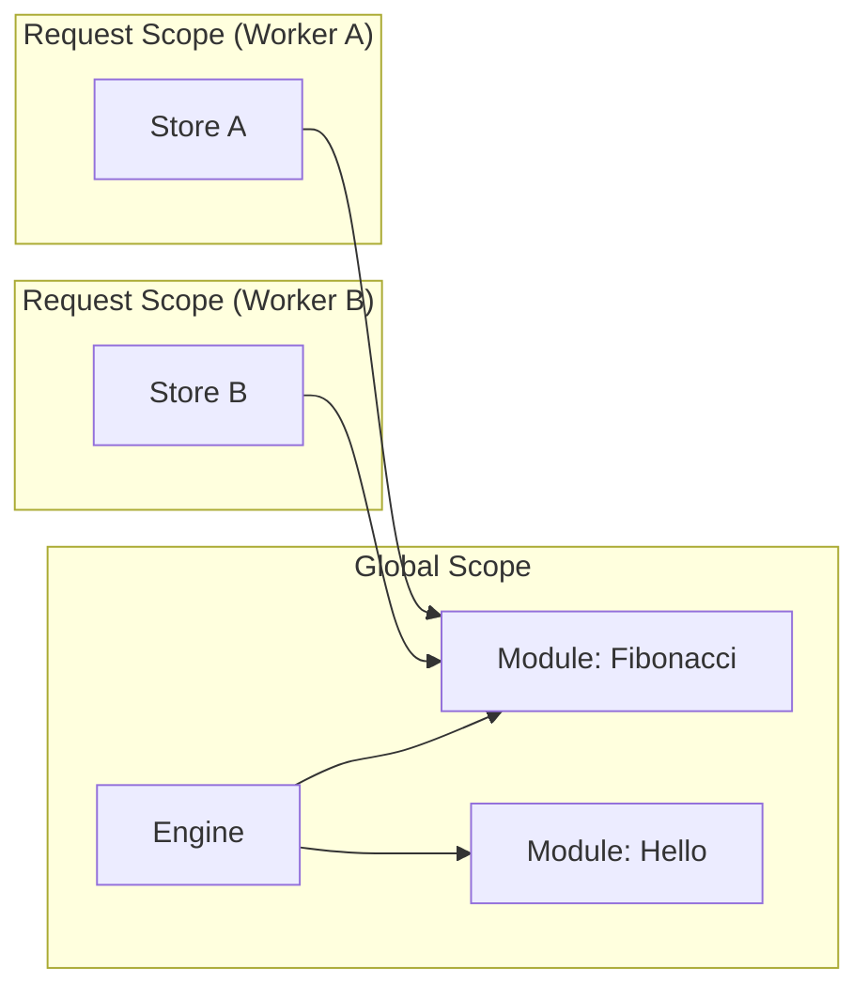

# 02 - Concurrency and Compute Micro-Architecture

## 1. Thread-Safe Module Caching: `DashMap` vs. `Mutex<HashMap>`

The platform employs a `DashMap<String, Module>` to store pre-compiled WebAssembly modules. This choice is critical for high-concurrency performance.

### 1.1 Lock Contention Analysis

In a standard `Arc<Mutex<HashMap<K, V>>>`, any read or write operation requires acquiring a global lock. Under a load of 15,000 RPS, this creates a significant bottleneck:

- **Lock Contention:** $T_{wait} \propto N_{threads} \times T_{hold}$
- **Throughput Ceiling:** Max RPS is limited by the serial nature of the lock.

### 1.2 Sharded Locking (DashMap)

`DashMap` utilizes a sharding strategy where the hash space is divided into $S$ independent shards (typically 32 or 64). Each shard has its own `RwLock`.

- **Probability of Collision:** $P(collision) \approx \frac{1}{S}$
- **Complexity:** The amortized cost of a lookup remains $O(1)$, but the parallel access capability increases by a factor of $S$.

---

## 2. Async Runtime Isolation: `spawn_blocking`

Wasm execution is fundamentally synchronous and CPU-bound. In a `tokio` environment, executing such tasks directly on a worker thread leads to **Runtime Starvation**.

### 2.1 The Starvation Problem

If a Wasm module executes a heavy computation (e.g., Fibonacci), it "pins" the Tokio worker thread. Since Tokio worker threads are fixed (usually equal to the number of CPU cores), a small number of concurrent Wasm tasks can prevent the runtime from:

- Processing new TCP handshakes.
- Responding to Kubernetes liveness/readiness probes (leading to premature Pod restarts).
- Handling I/O completion for other tasks.

### 2.2 Thread Pool Handoff

By using `tokio::task::spawn_blocking`, the Runner offloads the Wasm task to a separate, dedicated thread pool managed by the OS.

- **Worker Thread:** Stays free to handle the "Glue" (HTTP, Buffering, Channel Send).
- **Blocking Pool:** Handles the "Heavy Lifting" (Wasm JIT execution).

---

## 3. Engine vs. Store Lifecycle

The `wasmtime` architecture requires a strict separation between shared immutable state and per-request mutable state.

### 3.1 Global `Engine` (Immutable)

The `Engine` is created once. It holds the JIT compiler configuration and is used to compile `Module`s.

- **Thread Safety:** `Send + Sync`.
- **Optimization:** Shared across all requests to reuse JIT optimizations and shared memory.

### 3.2 Per-Request `Store<T>` (Mutable)

A `Store` represents a single execution context. It holds the `WasiCtx` and the guest's linear memory.

- **Isolation:** Total. A crash in one `Store` cannot corrupt another.
- **Cost:** Low. Creating a `Store` is cheap compared to compiling a `Module`.

---

## 4. Concurrency Model Summary

The concurrency model is optimized for **CPU saturation without latency spikes**:

- **Gateway:** Non-blocking Async (Axum).
- **Compute:** Isolated Thread Pool (spawn_blocking).
- **Coordination:** Lock-free / Sharded-lock structures (DashMap, MPSC).
