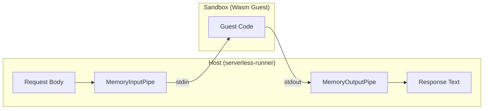

# 04 - Resource Management and Isolation

## 1. Sandboxing: The "Trust-Free" Model

The Serverless Runner enforces a "Capability-Based" security model through WASI (WebAssembly System Interface). A guest module is restricted to a strictly defined subset of system calls.

### 1.1 Memory Isolation

The guest operates within a "Linear Memory" address space.

- **Direct Access:** The guest cannot see host memory, pointers, or stack frames.
- **Boundary Checks:** Every memory access is bounds-checked by the `wasmtime` engine at runtime.

### 1.2 Capability-Based I/O

Instead of giving the guest access to the host file system or network, the Runner injects **Virtual Pipes**.

---

## 2. Deterministic Resource Limits

To prevent "Noisy Neighbor" effects and malicious resource exhaustion (e.g., Infinite Loops or Memory Hogs), the system enforces hard limits.

### 2.1 CPU: Fuel Metering

CPU time is measured in "Fuel" (abstract instruction units) rather than wall-clock time. This ensures **deterministic execution** regardless of host CPU load.

- **Budget ($B$):** 100,000,000 units.
- **Condition:** $\sum \text{cost}(instruction_i) \le B$.
- **Failure:** Triggers a `FuelTrap`, mapped to `504 Gateway Timeout`.

### 2.2 Memory: The 64MB Ceiling

The guest is limited to 64 MiB of linear memory. This is enforced during the `memory.grow` instruction.

$$M_{new} = M_{current} + \Delta M$$
$$\text{If } M_{new} > 64 \text{ MiB, Trap.}$$

### 2.3 Output: The 1MB Snippet

The `MemoryOutputPipe` is bounded to 1MB. If a guest attempts to spam `stdout`, the host stops reading and returns the truncated buffer, preventing memory exhaustion in the Runner pod itself.

---

## 3. The Virtualization Tax vs. Isolation

| Aspect                | Impact         | Mitigation                                                                      |
| :-------------------- | :------------- | :------------------------------------------------------------------------------ |
| **Instantiation**     | ~50ms Overhead | **Module Caching:** Pre-compile Wasm to Machine Code.                           |
| **Fuel Metering**     | ~5-10% CPU Tax | **Cranelift Optimizations:** Inline fuel checks during JIT.                     |
| **Context Switching** | ~1ms Handoff   | **Async/Sync Decoupling:** Use `spawn_blocking` to maximize thread utilization. |

---

## 4. Resource Policy Table

| Resource                  | Value             | Enforcement Layer       |
| :------------------------ | :---------------- | :---------------------- |
| **Max Memory**            | 64 MiB            | Wasmtime Runtime        |
| **Max Execution (Fuel)**  | 100,000,000 Units | Wasmtime Engine         |
| **Max Stdout**            | 1 MiB             | MemoryOutputPipe (Host) |
| **Network Access**        | **NONE**          | WASI Sandbox            |
| **Filesystem Access**     | **NONE**          | WASI Sandbox            |
| **Environment Variables** | Filtered Set      | WasiCtxBuilder          |
