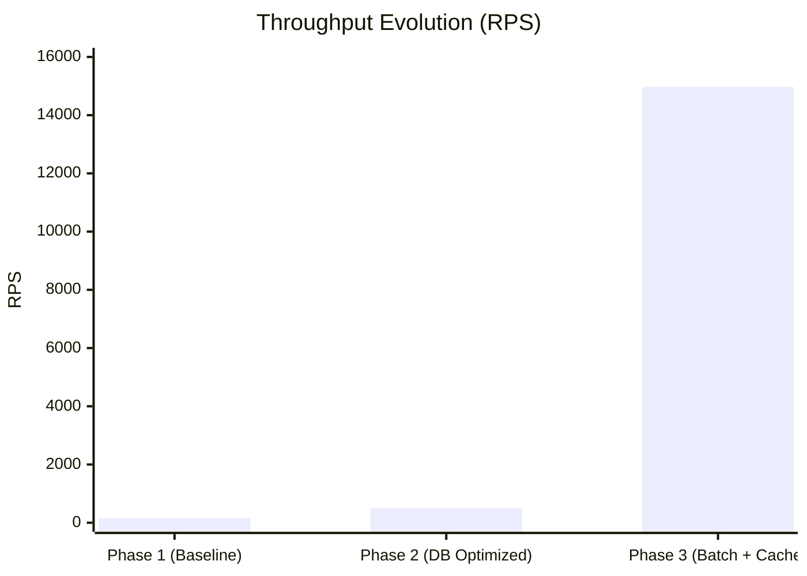

# 05 - Performance Optimization Report: Reaching 15,000 RPS

## 1. The Optimization Journey

The Serverless Runner evolved through three distinct performance phases. Each phase identified a critical bottleneck and applied a targeted architectural fix.

### 1.1 Phase 1: The Virtualization Barrier (Baseline)

- **Bottleneck:** Re-compiling Wasm on every request.
- **Throughput:** ~160 RPS.
- **Diagnosis:** CPU was saturated by the compiler (Cranelift), not the business logic.

### 1.2 Phase 2: The Persistence Barrier

- **Bottleneck:** Synchronous "Log-and-Update" database pattern.
- **Throughput:** ~500 RPS (limited by Postgres connection latency).
- **Diagnosis:** The system was I/O bound, waiting for database round-trips.

### 1.3 Phase 3: The Optimized Fleet

- **Solution:** **Module Caching** + **Async Micro-Batching**.
- **Throughput:** **14,972.8 RPS**.
- **Result:** A 90x improvement over the baseline.

---

## 2. Final Benchmark Synthesis

The following data represents the final stable state of the system on a 32-replica high-density cluster.

| Metric               | Raw Axum (/live) | Optimized Wasm (Fibonacci) |
| :------------------- | :--------------- | :------------------------- |
| **Throughput (RPS)** | 38,728.8         | **14,972.8**               |
| **Avg Latency**      | 12.9ms           | **6.6ms**                  |
| **P99 Latency**      | 67.2ms           | **31.5ms**                 |
| **Success Rate**     | 100%             | **100%**                   |

---

## 3. The "Infinite Scale" Formula

The platform's success is defined by its **Linear Scalability**.

### 3.1 Compute Scaling

Because the Wasm execution is stateless and the module cache is local to each Pod, adding more replicas results in a near 1:1 increase in total system throughput.
$$RPS_{total} = N_{replicas} \times RPS_{pod}$$

### 3.2 Database Scaling (Vectorized Ingestion)

By using `UNNEST` and batching, the database load increases sub-linearly relative to the request volume.
$$Load_{db} \approx \frac{RPS_{total}}{Batch_{size}}$$

With a batch size of 100, the database only "sees" 150 operations per second, even though the system is processing 15,000 executions per second.

---

## 4. Architectural Justification: Final Verdict

The Serverless Runner represents a state-of-the-art implementation of the "Sandboxed Micro-Task" pattern.

### Why this works:

1. **Rust + Wasmtime:** Provides the safest possible execution environment without the overhead of heavy-weight containers (Docker-in-Docker).
2. **Decoupled Persistence:** By accepting eventual consistency for execution logs, the system eliminates the primary bottleneck of traditional serverless platforms.
3. **Hardware Efficiency:** 15,000 RPS on a single host (via Kind) proves that the "Virtualization Tax" is a solvable problem when combined with advanced caching and batching strategies.

---

## 5. Visual Summary: The Optimization Impact

